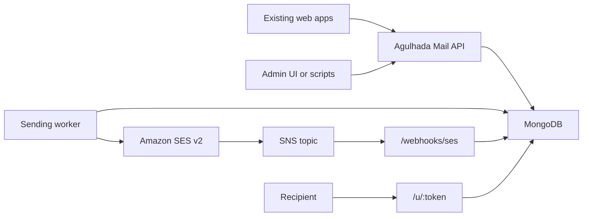

# MVP Architecture

## Goal

Replace Mailjet for two needs:

1. Campaigns for roughly 500 to 5000 registered subscribers.
2. Transactional email for web apps, such as welcome emails, payment notices, login-related messages, and support notifications.

The MVP should be small enough to reason about, but safe enough not to damage sender reputation.

## Components

## Design Choices

- Use MongoDB for the queue. At 500 to 5000 recipients per campaign, a leased queue collection is simpler than adding Redis or SQS on day one.
- Use SES v2 `SendEmail` with one recipient per API call for campaigns. This enables per-recipient unsubscribe links, tags, and event correlation.
- Use a configuration set for event publishing. Bounces and complaints update local suppression state.
- Separate marketing and transactional categories. A marketing unsubscribe should stop campaigns, but should not block receipts or account/security email.
- Use account-level suppression plus local suppression. SES protects the account; the app protects your product logic and analytics.

## Delivery Rules

Campaign send eligibility:

- subscriber status is `subscribed`;
- list membership is active;
- no local suppression for `bounce`, `complaint`, or `manual`;
- campaign has not already sent to the subscriber;
- worker lease has not expired.

Transactional send eligibility:

- do not check marketing unsubscribe;
- do check hard bounce, complaint, and manual suppression;
- allow category-specific opt-outs later if needed.

## Sending Queue

The queue is a MongoDB collection named `email_jobs`.

Each job is one email to one recipient. A worker atomically leases pending jobs, sends them through SES, then records `sent`, `failed`, or `retrying`.

The MVP worker:

- sends in batches;
- respects `SEND_RATE_PER_SECOND`;
- retries transient failures with exponential backoff;
- stores the SES `MessageId`;
- tags every SES send with `messageId`, `campaignId`, `subscriberId`, and `category`.

## Deliverability Guardrails

- Start with very small batches after SES production access is approved.
- Use a verified domain, Easy DKIM, custom MAIL FROM, SPF, and DMARC.
- Include a physical mailing address and clear unsubscribe link in every campaign email.
- Use `List-Unsubscribe` and `List-Unsubscribe-Post` headers for campaigns.
- Suppress complaints immediately.
- Suppress permanent bounces immediately.
- Monitor bounce and complaint rates before scaling.

